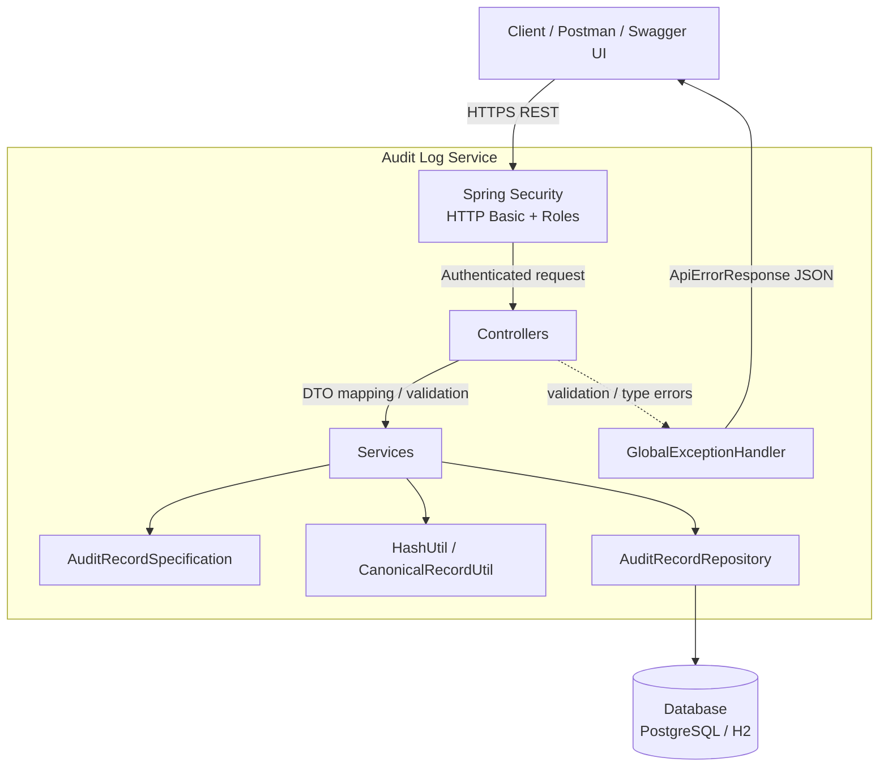

# Architecture Overview

## 1. High-Level Architecture

The **Audit Log Service** is a Spring Boot 3 application that stores immutable, append-only audit events and exposes REST APIs for search, integrity verification, redaction, retention archival, export, statistics, and Merkle-root generation.

Tamper evidence is provided by a **SHA-256 hash chain**: each record stores its own content hash and the previous record’s hash. The first record links to a configured genesis value (`audit.log.genesis-value`). A Merkle root over record hashes supports efficient bundle-level integrity checks.

**Runtime stack**

| Concern | Technology |
|---------|------------|
| Application | Spring Boot 3.x, Java 17 |
| API | Spring MVC REST + Bean Validation + OpenAPI |
| Security | Spring Security (HTTP Basic, method-level `@PreAuthorize`) |
| Persistence | Spring Data JPA / Hibernate |
| Production DB | PostgreSQL |
| Local / test DB | H2 in-memory |
| Hashing | SHA-256 (`HashUtil`) |

### Architecture diagram



---

## 2. Component Responsibilities

### Controllers

Thin HTTP adapters under `com.example.audit.controller`. They validate input, enforce roles via `@PreAuthorize`, map entities to DTOs, and return HTTP status codes.

| Controller | Endpoints | Allowed roles |
|------------|-----------|---------------|
| `AuditRecordController` | `POST /audit`, `GET /audit` | Create: ADMIN, SYSTEM · Search: ADMIN, AUDITOR, SYSTEM |
| `AuditSearchController` | `GET /audit/search` | ADMIN, AUDITOR, SYSTEM |
| `AuditPayloadController` | `GET /audit/{id}/payload` | ADMIN, AUDITOR |
| `AuditVerificationController` | `GET /audit/verify` | ADMIN, AUDITOR |
| `AuditRecordVerificationController` | `GET /audit/verify/{id}` | ADMIN, AUDITOR |
| `AuditMerkleController` | `GET /audit/merkle/root` | ADMIN, AUDITOR |
| `AuditExportController` | `GET /audit/export` | ADMIN, AUDITOR |
| `AuditRedactionController` | `POST /audit/redact/{id}` | ADMIN |
| `AuditArchiveController` | `POST /audit/archive` | ADMIN |
| `AuditStatisticsController` | `GET /audit/stats` | ADMIN, AUDITOR |

### Services

Business logic under `com.example.audit.service`:

| Service | Responsibility |
|---------|----------------|
| `AuditRecordService` | Append-only create; sequence assignment; previousHash linkage; canonical hash; search via Specifications. Concurrent appends are serialized so chain order stays consistent. |
| `AuditSearchService` | Paginated search with optional filters, ordered by `sequenceNumber`. |
| `AuditVerificationService` | Full-chain verification (recompute hashes + previousHash links). |
| `AuditRecordVerificationService` | Single-record hash recompute and compare. |
| `MerkleTreeService` | Build Merkle tree from stored hashes; return root. |
| `AuditExportService` | Read-only export bundle with optional filters and Merkle metadata. |
| `AuditRedactionService` | Mask top-level JSON fields into `redactedPayload` without changing original hash fields. |
| `AuditPayloadViewService` | Return original or redacted payload view. |
| `AuditArchiveService` | Soft-archive records older than retention window. |
| `AuditStatisticsService` | Aggregate counts (total / archived / active). |

### Repository

`AuditRecordRepository` extends `JpaRepository` and `JpaSpecificationExecutor`.

Focused query methods support:

- Latest / earliest record by sequence (append + metadata)
- Ordered full-chain load (verification / export / Merkle)
- Actor- and resource-scoped export queries
- Expired non-archived records (retention)
- Archived / non-archived counts (statistics)

### Entity

`AuditRecord` is the single JPA entity (`audit_records`):

- Core event fields: `eventType`, `actorId`, `resourceType`, `resourceId`, `payload`, `timestamp`
- Chain fields: `sequenceNumber` (unique), `previousHash`, `hash`
- Retention: `archived`, `archivedAt`
- Privacy: `redactedPayload` (optional sanitized copy)

Records are effectively immutable for chain fields after creation. Only archival and redaction update non-chain columns.

### DTOs

Request / response objects under `com.example.audit.dto` (plus `AuditStatisticsResponse` in the controller package) isolate the API contract from persistence:

- **Requests:** `AuditRecordRequest`, `RedactionRequest`
- **Create / search:** `AuditRecordResponse`, `AuditRecordSearchResponse`, `AuditSearchResponse`
- **Integrity:** `ChainVerificationResponse`, `RecordVerificationResponse`, `MerkleRootResponse`
- **Export:** `ExportBundleResponse`, `ExportRecordResponse`
- **Other:** `PayloadResponse`, `RedactionResponse`, `ArchiveResponse`

Search and export DTOs intentionally omit internal fields such as `archived` / `archivedAt` where not required by the API.

### Utility classes

| Utility | Role |
|---------|------|
| `CanonicalRecordUtil` | Builds a deterministic pipe-separated canonical string for hashing (includes sequence and previousHash). |
| `HashUtil` | Thread-safe SHA-256 → lowercase hex. |
| `AuditRecordSpecification` | Dynamic JPA Specifications for optional search filters. |

### Exception handling

`GlobalExceptionHandler` (`@RestControllerAdvice`) maps validation and request-parsing failures to a consistent `ApiErrorResponse` (timestamp, status, error, message, path):

- `MethodArgumentNotValidException` → 400
- `ConstraintViolationException` → 400
- `HttpMessageNotReadableException` → 400
- `MethodArgumentTypeMismatchException` → 400
- `IllegalArgumentException` → 400

Unhandled domain failures (for example `RuntimeException("AuditRecord not found")`) are not mapped by this advice and surface as uncaught exceptions in the current implementation.

### Security configuration

`SecurityConfig`:

- HTTP Basic authentication
- BCrypt password encoding
- Stateless sessions; CSRF disabled for REST
- In-memory users: `admin` (ADMIN), `auditor` (AUDITOR), `system` (SYSTEM)
- Swagger / OpenAPI paths permitted anonymously
- All other requests authenticated
- Method security enabled (`@EnableMethodSecurity`) so `@PreAuthorize` on controllers is enforced

---

## 3. Generic Request Flow

```text
Client
  ↓
Spring Security (authenticate → authorize)
  ↓
Controller (validate + map)
  ↓
Service (business rules)
  ↓
Repository (JPA)
  ↓
Database
```

Unauthorized callers receive **401**. Authenticated callers without the required role receive **403**.

---

## 4. Audit Append Flow

```text
POST /audit (ADMIN | SYSTEM)
  → AuditRecordController
  → AuditRecordService.appendRecord
       1. Truncate timestamp to microsecond precision
       2. Under append lock + transaction:
          - Load latest by sequenceNumber
          - nextSequence = latest + 1 (or 1)
          - previousHash = latest.hash (or genesis)
          - Build canonical string
          - hash = SHA-256(canonical)
          - Persist AuditRecord
  → 201 Created + AuditRecordResponse
```

Replay of an identical payload creates a **new** record (append-only; not client-idempotent).

---

## 5. Search Flow

Two search entry points share filtering concepts:

| Endpoint | Service path |
|----------|--------------|
| `GET /audit` | `AuditRecordService.search` → Specifications |
| `GET /audit/search` | `AuditSearchService.search` → Specifications + page/size |

```text
GET /audit or GET /audit/search
  → Controller (role check)
  → Build Specification from optional filters
       (actorId, resourceType, resourceId, eventType, time range where supported)
  → Repository.findAll(spec, pageable)
  → Map to search DTO page (payload excluded)
  → 200 OK
```

Results are ordered by `sequenceNumber` ascending.

---

## 6. Verification Flow

### Full chain — `GET /audit/verify`

```text
AuditVerificationService.verifyChain
  → Load all records ordered by sequenceNumber
  → expectedPrevious = genesis
  → For each record:
       - Recompute hash from canonical fields (using stored previousHash)
       - Fail on hash mismatch
       - Fail if stored previousHash ≠ expectedPrevious
       - expectedPrevious = record.hash
  → ChainVerificationResponse (intact or first break)
```

Archived records remain part of the chain so historical tamper evidence is preserved.

### Single record — `GET /audit/verify/{id}`

```text
AuditRecordVerificationService.verifyRecord
  → Load by id (missing → RuntimeException)
  → Recompute hash; compare to stored hash
  → RecordVerificationResponse
```

---

## 7. Merkle Root Generation Flow

```text
GET /audit/merkle/root
  → MerkleTreeService.computeMerkleRoot
       1. Load hashes in sequence order
       2. If empty → empty root string
       3. Else iteratively hash pairs: SHA-256(left || right)
          - Odd count: duplicate last leaf/node
       4. Return MerkleRootResponse (totalRecords, merkleRoot, generatedAt)
```

Merkle computation is read-only and does not alter stored records.

---

## 8. Export Flow

```text
GET /audit/export?actorId=… | resourceType+resourceId=…
  → AuditExportService.export
       1. Select records (all / by actor / by resource), sequence order
       2. Map to ExportRecordResponse (export fields only)
       3. Compute Merkle root over exported hashes (reuse MerkleTreeService)
       4. Attach bundle metadata:
          first/last sequence, first/last hash, merkleRoot, generatedAt, filters
  → ExportBundleResponse
```

Export is read-only and does not change the live hash chain.

---

## 9. Redaction Flow

```text
POST /audit/redact/{id} (ADMIN)
  → AuditRedactionService.redactFields
       1. Load record
       2. Parse original payload JSON
       3. Mask requested top-level fields (********)
       4. Store result in redactedPayload only
       5. Leave payload, hash, previousHash, sequenceNumber unchanged
  → RedactionResponse

GET /audit/{id}/payload?redacted=true
  → Prefer redactedPayload when present; otherwise original payload
```

Chain verification always uses the **original** payload and hashes.

---

## 10. Archive Flow

```text
POST /audit/archive (ADMIN)
  → AuditArchiveService.archiveExpiredRecords
       1. cutoff = now − audit.retention.days
       2. Find timestamp ≤ cutoff AND archived = false
       3. Set archived = true, archivedAt = now
       4. Do not delete rows; do not touch hash-chain columns
  → ArchiveResponse (count + message)
```

Soft archival supports retention policy without breaking historical verification.

---

## 11. Design Decisions

1. **Append-only hash chain** — Server-assigned `sequenceNumber` and `previousHash` provide linear tamper evidence.
2. **Genesis value** — Configurable first-link hash avoids a special-case null previous hash.
3. **Microsecond timestamps** — Truncation before hashing avoids precision mismatch between JVM `Instant` and JPA persistence.
4. **Canonical string hashing** — Fixed field order and separators ensure deterministic hashes.
5. **Soft redaction** — Separate `redactedPayload` protects privacy without rewriting the chain.
6. **Soft archival** — Retention marks records archived; verification still includes them.
7. **Merkle root for exports** — Bundle consumers can verify a set of hashes without replaying the full linear algorithm alone.
8. **Layered Spring architecture** — Controllers / services / repository / utilities keep responsibilities clear.
9. **Method-level RBAC** — Coarse HTTP authentication plus fine-grained `@PreAuthorize` per endpoint.
10. **Serialized appends** — In-process lock around transactional append prevents concurrent sequence collisions while keeping a single-writer chain model simple.

---

## 12. Trade-offs

| Choice | Benefit | Cost |
|--------|---------|------|
| Full-chain verification O(n) | Strong, simple integrity story | Expensive as the log grows |
| Store full payloads | Complete forensic detail | Storage growth |
| Soft delete / soft redact | Preserves hash history | Sensitive data may remain in DB until purged externally |
| In-memory users | Fast local demo / assessment | Not suitable for production identity |
| JVM append lock | Correct concurrent appends on one node | Does not coordinate multi-instance writers |
| H2 for tests / Postgres for prod | Portable CI | Dialect / type nuances must be watched |
| Unmapped `RuntimeException` for not-found | Minimal code | Clients may see 500 / servlet errors instead of clean 404 JSON |

---

## 13. Future Improvements

1. Map “not found” and other domain errors to typed exceptions and HTTP 404/409 via `GlobalExceptionHandler`.
2. Replace in-memory users with an external IdP (OAuth2 / OIDC / LDAP).
3. Distributed append coordination (DB advisory locks, sequence table, or outbox) for multi-instance deployments.
4. Streaming / chunked export for large datasets.
5. Digitally signed export bundles.
6. Configurable nested redaction and field policies.
7. Optional cold storage for archived records while keeping chain checkpoints.
8. Checkpointed or parallel verification to reduce full-scan cost.
9. Audit of privileged operations (who exported / redacted / archived).
10. Stricter CORS and credential management for production.

---

## Related Documents

- `docs/API.md` — Endpoint contracts
- `docs/REQUIREMENTS.md` — Functional and non-functional requirements
- `docs/MERKLE_TREE.md` — Merkle algorithm notes
- `docs/SCENARIO_C.md` — Compliance reporting scenario
- `docs/AI_USAGE.md` — AI assistance traceability
